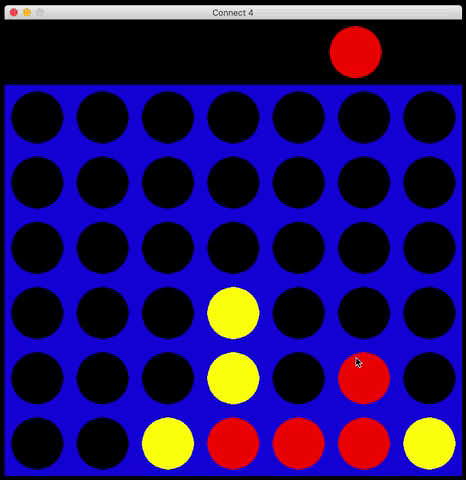

# Sistemas Operativos 2022-2. Práctica 01: Introducción a C

## 1. Objetivo
El objetivo de esta práctica es que el estudiante se familiarice con el lenguaje de programación C a través de la resolución de un problema sencillo. En especifico esperamos que se familiarice con los siguientes conceptos: el paradigma estructural, uso de arreglos, uso de apuntadores, uso de estrcuturas, uso correcto de memoria en el heap y en el stack, y uso de cadenas de caracteres.

## 2. Introducción

### 2.1 Git
GIT es el sistema de control de versiones, que vamos a utilizar para todas las prácticas de este curso. Por lo que es importante que estés familiarizado con las operaciones básicas de git y con su funcionamiento elemental. Algunos conceptos importantes incluyen:

* __Tracked__ y __Untracked__ Files.
* __Working Area__, __Staging Area__, __Commits__.
* __Branches__ y __Merging Strategies_.

Puedes consultar algunos de estos conceptos y otros más en las notas de clase y en los siguientes enlaces

* [Documentación de Atlassian](https://www.atlassian.com/git/tutorials/what-is-version-control)
* [Libro Pro GIT](https://git-scm.com/book/en/v2)

### 2.2 GitHub

GitHub es el sitio donde vamos a subir los repositorios de las prácticas de este curso, por lo que es necesario que tengas una cuenta activa en esta plataforma y que tu computadora esté vinculada a dicha cuenta para que puedas subir y bajar código. También es necesario que estés familiarizado con algunos conceptos básicos de github como:

* __Hosted Repository__: cómo crearlo, clonarlo o hacer un fork.
* Actualizar un __Hosted Repository__: cómo bajar una branch que no existe en local, y cómo actualizar una branch en el  remote repository.
* __Pull Request__: qué es y cuál es su función principal, cómo abrir uno nuevo.
* __Fork__: qué es y cómo se crea uno, y cual es su uso habitual.

### 2.3 Configuración con CircleCI. 

Configura este repositorio para que ejecute las pruebas unitarias por medio de CircleCI. Ya incluimos el archivo de configuración, por lo que solo tienes que crear una cuenta en circleci viculanda tu cuenta de github, y hacer que sobre este proyecto se ejecuten los workflows/jobs de circleci cada vez que un Pull Request es creado o actualizado.

* `.circleci/config.yml`

### 2.4 Docker
Para todas las prácticas del curso utilizaremos un _contenedor_ de __Docker__  que incluye las herramientras necesarias para compilar y ejecutar el código en el que trabajarás.

Primero necesitarás instalar __Docker__  en tu sistema operativo, y una terminal que pueda ejecutar scripts de bash. En estos enlaces puedes encontrar isntrucciones de cómo instalar __Docker__ en tu sistema operativo.

* [Linux](https://docs.docker.com/install)
* [MacOS](https://docs.docker.com/docker-for-mac/install/)
* [Windows](https://docs.docker.com/docker-for-windows/)

Una vez que tengas instalado Docker, posiciona la terminal en el direcrtorio raíz de esta práctica y ejecuta el comando `./docker-exec build-image`, el cual descargará y construirá localmente una imagen de alpine con las herramientras necesarias para trabajar con esta práctica. Este script utiliza bash por lo que solo podrá ser ejecutado en terminales con este contexto de ejecución. Para windows hay dos opciones, instalar una terminal que acepte comando de bash como [cygwin](https://www.cygwin.com) o adaptar el script `docker-exec` para que funcione en la terminal de windows.

A continuación una lista de todos los comandos disponibles en el script `docker-exec`:

• `./docker-exec compile` compila el código fuente que se encuentra en el directorio __src__ utilizando el contenedor de docker.

• `./docker-exec test` ejecuta las pruebas que verifican que tu implementación refleje la especificación..

• `./docker-exec clean` elemina el archivo ejecutable generado con la acción ` compile`.

• `./docker-exec "any other command"` ejecuta la instrucción `any other command` dentro del contenedor de docker, por ejemplo puedes ejecutar `./docker-exec "gcc --version"` para ver qué version de `gcc` está instalada dentro del contenedor.

### 2.5 Compilador de C (GCC)

Para este curso utilizaremos gcc como compilador de C. En los sistemas operativos tipo Unix, gcc es un programa que puede ser invocado desde una terminal. Así que asumiendo que tienes una terminal abierta, ejecuta la siguiente instrucción:

```bash
$ gcc --version
```

Puedes ejecutar este comando en el contenedor de docker utilizando el script `./docker-exec gcc --version`

Lo anterior desplegará un resumen de la versión de gcc que está instalada en tu sistema. Usualmente los archivos que contienen código fuente de C tienen como extención .c, por ejemplo un archivo que contiene un programa en C podría llamarse hola_mundo.c. Para compilar el archivo hola_mundo.c, asumiendo que el directorio actual de trabajo lo contiene , tenemos que ejecutar un comando como el siguiente dentro de una terminal:

```bash
$ gcc -Wall -Werror -o mi_programa hola_mundo.c
```

Si el archivo `hola_mundo.c` no tiene errores de sintaxis ni de semántica, el comando anterior crea un archivo ejecutable con el nombre `mi_programa`. El comando anterior utiliza algunas banderas de compilación de **gcc**, a continuación una breve descripción de cada una de ellas: 

* `-Wall`: le indica a gcc que nos proporcione advertencias que involucren posibles errores semáticos dentro del programa, esta bandera no recibe argumentos, es muy recomendable utilizar para evitar algunos errores de ejecución. 

* `-Werror`: le indica a gcc que trate las adventencias como errores, es decir, no genera el ejecutable hasta que los corrijamos. 

* `-o`: le indica a gcc el nombre que vamos a dar al ejecutable generado como consecuencia del proceso de compilación.


### 2.6 Referencias para aprender C

En internet existen una gran variedad de referencias y tutoriales para aprender C y para consultar su API, así que eres libre de consultar los materiales que tú desees, en particular puedes descargar un buen libro de la siguiente dirección:

http://cslibrary.stanford.edu/101/

Para consultar el API pueden consultar el siguiente sitio:

http://www.cplusplus.com/reference/

Cabe mencionar que ambas fuentes para algunos componentes están enfocados a sistemas operativos unix-like.


## 3. Problema

### 3.1 Descripción de "Conecta 4"
En el juego de Conecta 4 se utiliza un tablero de `6 x 7` en el que dos jugadores toman turnos para tirar fichas circulares dentro de este, para ello deben de elegir una columna que aun no esté llena y en ella dejan caer una ficha correspondiente a su color. Gana el primer jugador que logra posicionar 4 fichas consecutivas en forma horizontal, vertical o diagonal.



### 3.2 Requerimientos
Para esta práctica vamos a trabajar con una versión muy simple pero genérica de este juego, no tendremos una interfaz gráfica, pero en su lugar vamos a tener una serie de pruebas automatizadas que verificarán que tu implementación es correcta.
 1. En el archivo `src/connect4.h`  tienes que agregar los atributos necesarios para representar un tablero para jugar este juego.
 2. Lee cuidadosamente la descripción de las funciones que se encuentran en el archivo `connect4.h`, luego implementa cada una de ellas en el archivo `connect4.c`, en este último ya se encuentra el cascaron de cada una de estas funciones.
 3. Para verificar que tu implementación refleja correctamente la especificación, corre las pruebas unitarias del proyecto por medio de docker. Para ello sigue estos pasos:
    - Inicia Docker en tu computadora, debe de estar corriendo el demonio para poder ejecutar cualquier de los comandos.
    - Ejecuta el comando `./docker-exec build-image`, el cual construye la imagen de docker que utilizarás para compilar y correr el código. 
    - Compila el código y ejecuta las pruebas unitarias utilizando el comando `make` o `make check`. Si pasas todas las pruebas vas a obtener una salida como esta:
    ```
    ./docker-exec compile
    ./docker-exec test
    Prueba 1: PASS
    Prueba 2: PASS
    Prueba 3: PASS
    Prueba 4: PASS
    Prueba 5: PASS
    Prueba 6: PASS
    SUMMARY 6/6 PASS
    TESTS SUCCEDED
    ```
    Si alguna prueba falla, este comando te va a dar feedback de qué es lo que se esperaba y qué encontró en el resultado producido por tu código. Puedes encontrar las salidas esperadas de cada una de las pruebas en el directorio `outputs`, la `Prueba 1` tiene su salida esperada en el archivo `outputs/test1.output`, y lo mismo para el resto de las pruebas.
    - En CircleCI las pruebas también deben de pasar. Puedes verificar esto en el Pull Request que fue abierto como parte de tu entrega.

## 4. Entrega

Para esta práctica, al momento de aceptar la tarea en Github Classroom se crea un fork del `template repository` que preparamos, por lo que no tendrás que crear un repositorio dentro de GitHub por ti mismo. Es importante mencionar que para esta práctica tienes que subir todo el código de tu solución a la rama **main**. Github Classroom crea por ti un Pull Request llamado **Feedback** en tu repositorio que compara tus cambios en `main` contra el código base que te fue entregado, es aquí donde agregaremos todos los comentarios al momento de calificar así como también conocerás qué calificación obtuviste en cada aspecto que evaluamos de esta práctica.